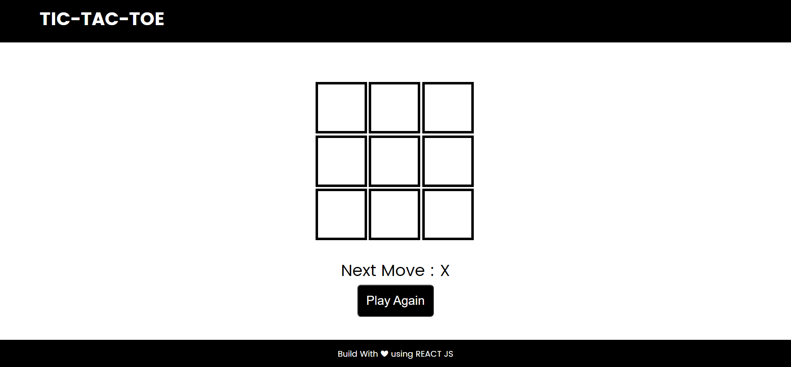

# Tic-Tac-Toe

## Desktop View



## Mobile View


---

## Build With

> React JS

## Live At

[Click To View](https://healer9.github.io/tic-tac-toe)

## To clone the repository run

```bash
    git clone https://github.com/healer9/tic-tac-toe.git
    npm install
    npm start
```

## Build By

> Anas Riyaz
